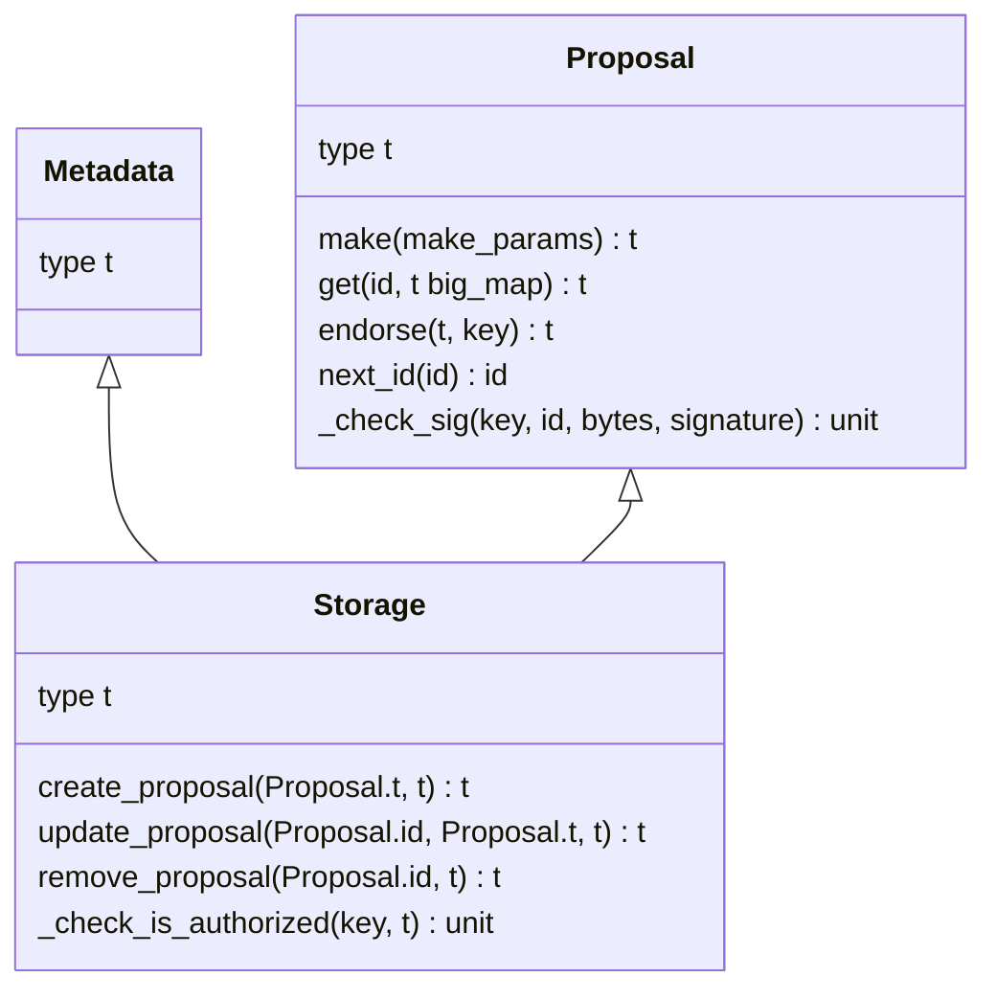
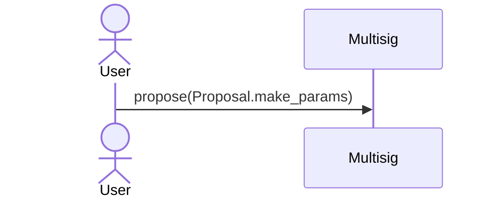
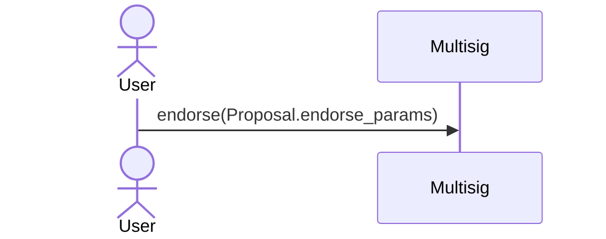

# multisig-cameligo

This contract implements an asynchronous variant of the
[generic multisig contract](https://tezos.gitlab.io/user/multisig.html#the-generic-multisig-contract).

What is identical to the generic multisig contract:

- it can receive tokens from unauthenticated sources on its default entrypoint of type unit
- the possible outcomes of an endorsed proposal are:
  - atomically execute an arbitrary list of operations (of type lambda unit (list operation) in Michelson)
  - update the contract storage to change both the threshold, and the participant public keys

What differs from the generic multisig contract:

- proposals are kept in storage until they reach a number of endorsements (threshold)
- the outcome is stored as a hash along the proposal
- endorsements and execution of the proposal are in separate entrypoints
- a proposal can be cancelled at any time

Finally, contrary to the generic multisig, this contract has not been formally verified.

## Requirements

The contract is written in `cameligo` flavour of [LigoLANG](https://ligolang.org/),
to be able to compile the contract, you need either:

- a [ligo binary](https://ligolang.org/docs/intro/installation#static-linux-binary),
  in this case, to use the binary, you need to have set up a `LIGO` environment variable,
  pointing to the binary (see [Makefile](./Makefile))
- or [docker](https://docs.docker.com/engine/install/)

For deploy scripts, you also need to have [nodejs](https://nodejs.org/en/) installed,
up to version 14 and docker if you wish to deploy on a sandbox.

## Usage

1. Run `make install` to install dependencies
2. Run `make` to see available commands

## Data types

## Entry points

### Create a proposal

A proposal is composed by:
  - a set of every endorser public key
  - the hash of the proposed outcome

### Endorse a proposal

